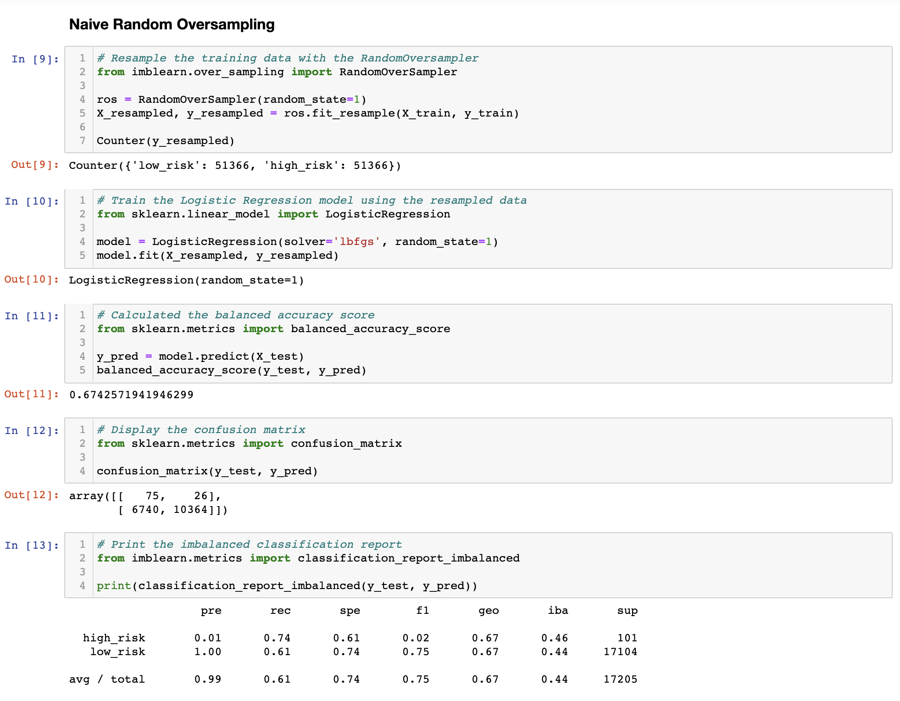

# Credit-Risk-Analysis

## Overview

We have been tasked with building six different machine learning models that can help our client to assess credit card risk. Due to the nature of credit risk, as an unbalanced classification problem, we will be utilizing the imbalanced-learn and scikit-learn packages. We will utilize a dataset provided by LendingClub, a peer to peer lending services company.

## Analysis

1. Our first model we tested was Naive Random Oversampling. The accuracy level for this model was 67.4%, which is not ideal and still leaves a large gap in possible error. 

2. Our second model we tested was SMOTE Oversampling. The accuracy level for this model was 66.2%, which is also not ideal and still leaves a large gap in possible error. 

3. Our third model we tested was Cluster Centroid Undersampling. The accuracy level for this model is even lower than the first two at 54.4%, and should not be used to assess credit card risk.

4. Our fourth model we tested was SMOTEENN. The accuracy level for this model was 64.3%, one again similar to the first two methods, and we should probably avoid this method as well. 

5. Our fifth model we tested was Balanced Random Forest Classifier. The accuracy level for this model was 78.8%, the highest accuracy level of the five models that we tested so far, but it does still leave a large margin of error. 

6. Our sixth model we tested was Easy Ensemble Classifier. Lastly, the accuracy level for our Easy Ensemble Classifier was 93.2%, which is by far the highest level of accuracy for any of our six tests. 

## Summary

All six machine learning models that were tested to assess credit risk present varying degrees of issues. 5 out of the 6 models we tested presented accuracy level below 80%. All six of the models are flawed in their ability to balance how well they each determine low risk credit and high risk credit. If we must use one of the models, I would recommend the last model, the Easy Ensemble Classifier, due to its high accuracy score, however, I think it would ultimately yield better results to continue to test different models, and to see if we can derive a new and better model, as despite its high accuracy score, as it is not a good model for predicting high risk credit.
